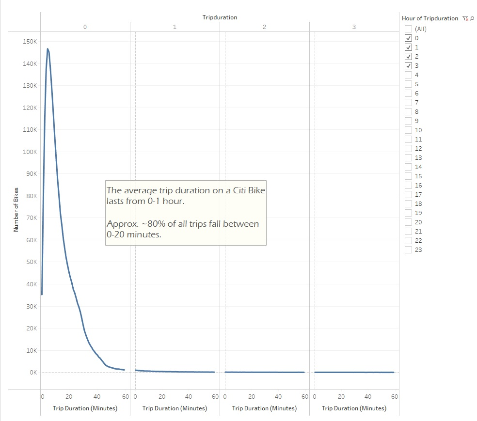
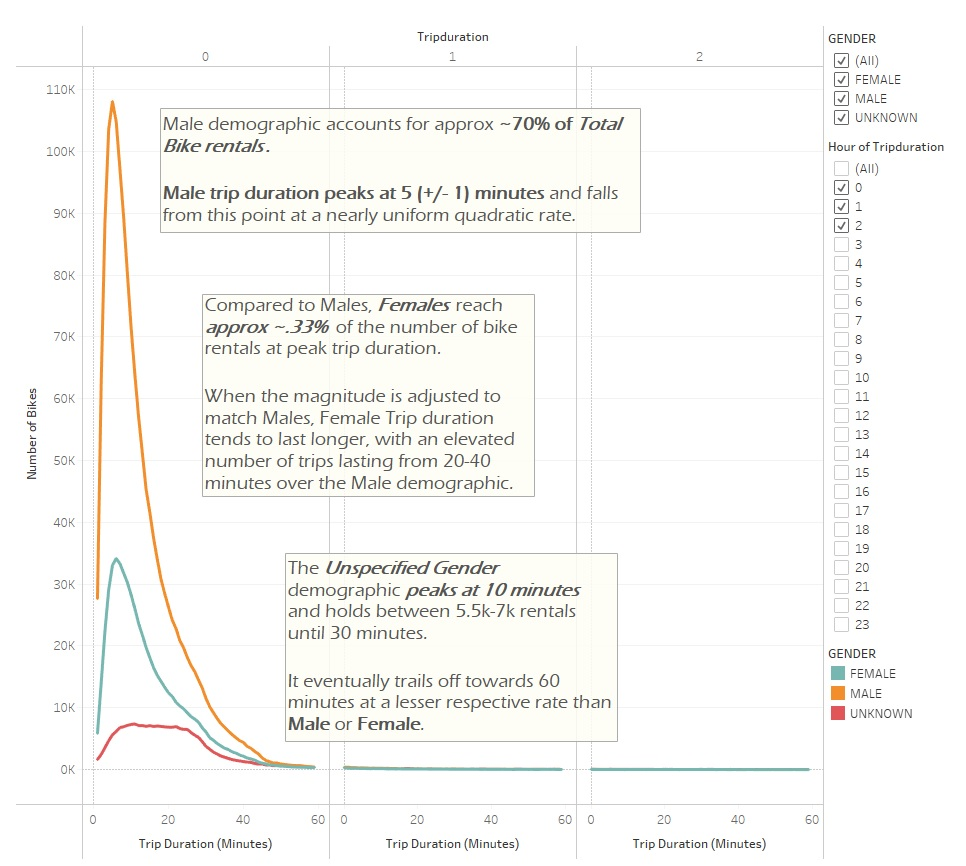
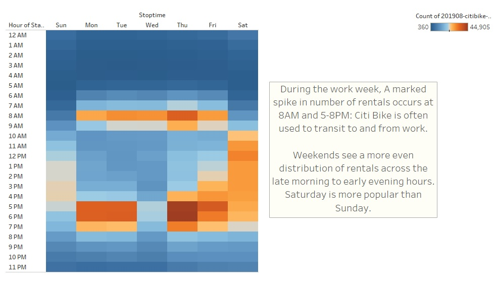
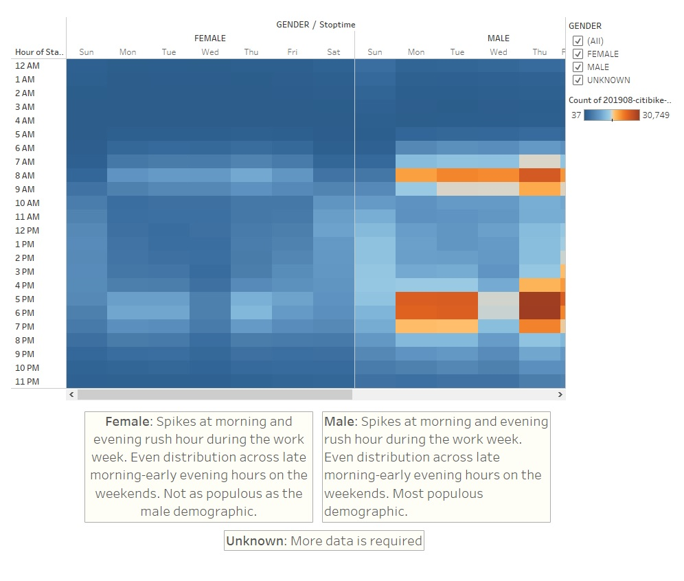
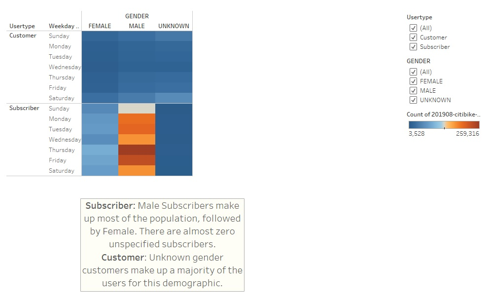
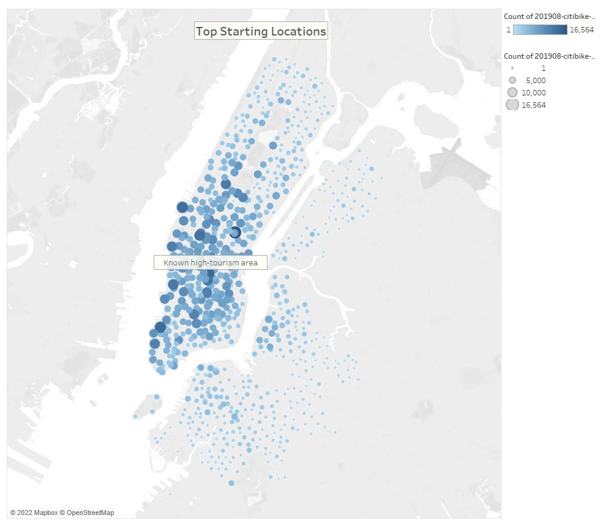
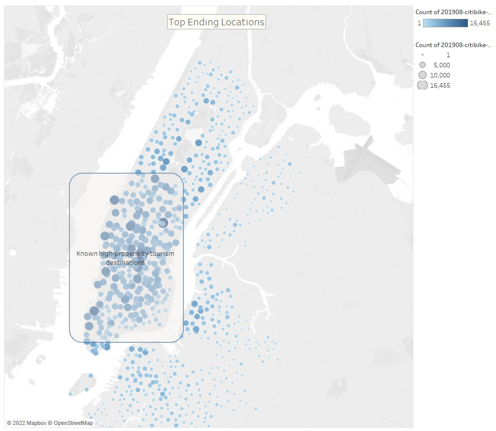

# Bikesharing
## Overview of the analysis:
Purpose: This analysis is created to demonstrate mastery in transforming data with Pandas and visualization of said data using Tableau.
 
 
Results: Each visualization is annotated with a significant finding.

Summary: While New York City is known to be a world-renown tourist destination, The data shown above describes Citi Bikes typical user as a Male subscriber that uses the service as an alternate mode of transportation to and from work. The question of wether tourisim counts towards the popularity of the Bike Sharing service is debunked when looking at the 5th visualization. The main User-Types of Citi Bikes are subscribed to the service which implies residence in New York. This is further proven when looking at the subscriber "Unknown" gender. This Subscriber sub-demographic has zero reported usage over the course of a week, wheras the Consumer "Unknown" gender demographic makes up a majority of the Customer-type users. This means that most tourists likely avoid reporting their gender by simply swiping a card and riding away. The customer demographic in its entirety makes up a negligible part of the populatuion of users. The Subscriber demographic holds a huge majority of the Citi Bike users, with the Male sub-demographic taking a vast lead over female users.
 
 
Additional Visualizations: The scope of the data analyzed is extremely narrow to be drawing conclusions with. To solidify the trends discovered in the analysis conducted above, here are more additional quereys that will assist in the likelihood of success of bike sharing in Des Moines, Iowa.:
* Widen the scope of time to include multiple years of data for NYC
* Compare average yearly tourist population in NYC to the trends in Bike Sharing popularity.
* Compare weather data throughout the year with Citi Bike data for the purpose of comparing number of rentals and average trip duration.
* Use bike GPS data to identify popular routes and areas.
* Compare weather data between Des Moines and NYC to discover differences/similarities. 

The full analysis story can be found at this
[link to Story](https://public.tableau.com/app/profile/daniel.fischer7142/viz/NYCCitiBikeStory_16548220952540/NYCCitiBikeStoryReport?publish=yes).